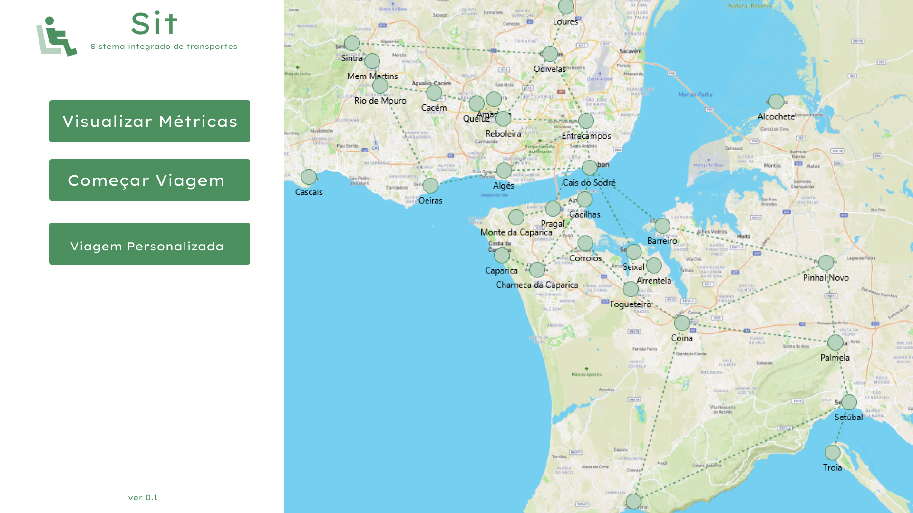

# Advanced Programming Project 2024/25 - Regular Season

[Versão em Português](README_PT.md)

## Index

1. [Authors](#authors)
2. [Project Summary](#project-summary)
3. [Data Structure](#data-structure)
4. [Mockup](#mockup)
5. [Documentation (Javadoc)](#documentation-javadoc)
6. [Libraries/Dependencies](#librariesdependencies)
7. [Java Development Kit](#java-development-kit)

## Authors

- João Fernandes - No. 202100718
- Rodrigo Santos - No. 202100722 [Team leader]
- Rúben Dâmaso - No. 202100723

## Project Summary

### Work Plan

The work plan, with the respective task assignments, can be found [here](planoTrabalho.pdf).

### Software Patterns

This project was developed following the MVC pattern.

### Solution Interpretation

In this project, there are 5 classes that model the solution: `TransportsMap`, `Stop`, `Route`, `Transport`, and `ScreenCoordinate`.
The dataset is imported (using `BufferedReader`) via the `TransportsMap` class and subsequently transposed into a graph.
With the returned data, the transport network (i.e., graph) is displayed on the screen.

## Data Structure

To support the transport network, a set of classes was defined to represent the problem.

### TransportsMap

The `TransportsMap` class has an inheritance relationship with `GraphEdgeList`, enabling the construction of the graph representing the transport network.
It contains the methods for importing the dataset.

### Stop

The `Stop` class represents the vertices of the graph, i.e., stops.

### Route

The `Route` class represents the edges of the graph, i.e., routes.

### Transport

The `Transport` class is an enumeration representing the available types of transport.

### ScreenCoordinate

The `ScreenCoordinate` class represents screen coordinates, where the graph's vertices will be displayed.

## Mockup
[Figma Mockups](https://www.figma.com/design/6vf2OhBaH9JJQQsLScNpZy/SIT?node-id=0-1&m=dev&t=Gg1asFDGfDcIlbe7-1)

Homepage representation:

## Documentation (Javadoc)

Documentation can be found [here](https://sit-javadoc.netlify.app/allclasses-index).

## Libraries/Dependencies

The project includes the following libraries imported from _Maven_:

- JUnit 5.8.1
- SmartGraph 2.0.0
- OpenCSV 5.9

## Java Development Kit

BellSoft Liberica JDK, version **17 LTS (FULL)**
