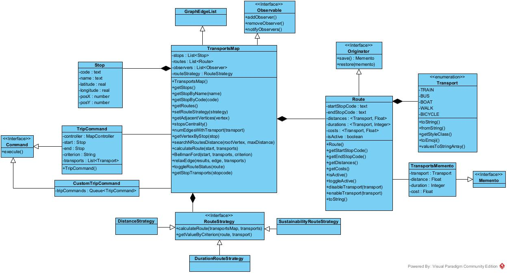

# Relatório Técnico

> **UC**: Programação Avançada
>
> **Alunos:**
>
> - João Fernandes - 202100718
> - Rodrigo Santos - 202100722
> - Rúben Dâmaso - 202100723
>
> **Turma**: PL2
>
> **Docente**: André Sanguinetti

## Índice

1. [Introdução](#1-introdução)
2. [Tipos Abstratos de dados](#2-tipos-abstratos-de-dados)
3. [Diagrama de Classes](#3-diagrama-de-classes)
4. [Padrões de Software](#4-padrões-de-software)
5. [Refactoring](#5-refactoring)
6. [Conclusão](#6-conclusão)

## 1. Introdução

No âmbito do primeiro projeto da Unidade Curricular (UC) de Programação Avançada (PA), do 1º semestre do 2º ano da Licenciatura em Engenharia Informática,
foi solicitado aos alunos que implementassem um programa para modelação de um grafo para representação da informação de um sistema integrado de transportes,
recorrendo aos princípios da orientação a objetos, utilização de padrões de design de software, na linguagem de programação Java.

O presente relatório tem como objetivo descrever a solução desenvolvida pelos alunos, bem como os detalhes da sua implementação.

## 2. Tipos Abstratos de Dados

De forma a modelar a informação do sistema integrado de transportes, foi implementado o tipo abstrato de dados `TransportsMap`,
que contém uma relação de herança com a classe `GraphEdgeList` da biblioteca `com.brunomnsilva.smartgraph`.
Assim, foi obtida uma implementação de grafo com lista de adjacências.

## 3. Diagrama de Classes



## 4. Padrões de Software

### Model-View-Controller (MVC)

O padrão MVC separa as funcionalidades principais de negócio, da apresentação e da lógica de controlo.

Este padrão foi utilizado uma vez que permite uma maior separação da interface de utilizador das funcionalidades de modelação do grafo.

Os participantes do padrão na solução concreta são os seguintes:

- Model:
  - `TransportsMap`
  - `Stop`
  - `Route`
- View - `MapView`
- Controller - `MapController`

### Observer

O padrão Observer é um padrão comportamental que permite definir um mecanismo de subscrição para notificar vários objetos sobre quaisquer eventos que ocorram no objeto que estão a observar.

Este padrão foi utilizado pois é necessário que aquando da atualização do modelo, por exemplo para apresentar um caminho, a View seja atualizada para refletir a alteração.

Os participantes do padrão na solução concreta são os seguintes:

- Subject - `TransportsMap`
- Observer - `MapView`

### Memento

O padrão Memento é um padrão comportamental que permite guardar e restaurar o estado anterior de um objeto sem revelar os detalhes da sua implementação.

Este padrão foi utilizado de forma a que fosse possível a inativação de rotas e respetivo restauro

Os participantes do padrão na solução concreta são os seguintes:

- Originator - `Route`
- Memento - `TransportMemento`
- Caretaker - `MapController`

### Command

O padrão Command é um padrão comportamental que transforma um pedido num objeto autónomo que contém todas as informações sobre o pedido. Esta transformação permite-lhe passar os pedidos como argumentos de um método, atrasar ou colocar em fila de espera a execução de um pedido e suportar operações que não podem ser feitas.

Este padrão foi utilizado para permitir a execução dos comandos de cálculo de caminhos personalizados.

Os participantes do padrão na solução concreta são os seguintes:

- Concrete Command: `CustomTripCommand`
- Invoker: `TripCommand`
- Client: `MapView`
- Receiver: `TransportsMap`

### Strategy

O padrão Strategy é um padrão comportamental que permite definir uma família de algoritmos, colocar cada um deles numa classe separada e tornar os seus objectos permutáveis.

Este padrão foi utilizado devido a existirem múltiplos critérios de otimização de caminhos (distância, duranção e sustentabilidade).

Os participantes do padrão na solução concreta são os seguintes:

- Context: `TransportsMap`
- Strategy: `RouteStrategy`
- ConcreteStrategies:
  - `DistanceRouteStrategy`
  - `DurationRouteStrategy`
  - `SustainabilityRouteStrategy`
- Client: `MapController`

## 5. Refactoring

Code Smell          | Nº de Ocorrências Detetadas | Técnica de Refactoring
--------------------|-----------------------------|------------------------
Duplicate Code      | 3                           | Extract Method
Data Class          | 1                           | Move Method
Long method         | 2                           | Extract Method
Long parameter list | 1                           | Preserve Whole Object

### Exemplos

#### Duplicate Code

```java
// Antes
public List<Vertex<Stop>> getAdjacentVertices(Vertex<Stop> stopVertex){
        List<Vertex<Stop>> adjacentVertices = new ArrayList<>();

        for(Edge<Route, Stop> edge : this.incidentEdges(stopVertex)){
            adjacentVertices.add(this.opposite(stopVertex, edge));
        }

        return adjacentVertices;
}

public List<String> getStopConnections(Vertex<Stop> stopVertex){
        List<String> connections = new ArrayList<>();

        for(Edge<Route, Stop> edge : this.incidentEdges(stopVertex)){
            Stop opposite = this.opposite(stopVertex, edge).element();
            connections.add(opposite.getName());
        }

        return connections;
    }


// Depois
public List<Vertex<Stop>> getAdjacentVertices(Vertex<Stop> stopVertex){
        List<Vertex<Stop>> adjacentVertices = new ArrayList<>();

        for(Edge<Route, Stop> edge : this.incidentEdges(stopVertex)){
            adjacentVertices.add(this.opposite(stopVertex, edge));
        }

        return adjacentVertices;
}
```

#### Data Class

```java
// Antes
public class ScreenCoordinate {
    private String stopCode;
    private int posX;
    private int posY;

    public ScreenCoordinate(String stopCode, int posX, int posY) {
        this.stopCode = stopCode;
        this.posX = posX;
        this.posY = posY;
    }

    public String getStopCode() {
        return stopCode;
    }

    public int getPosX() {
        return posX;
    }

    public int getPosY() {
        return posY;
    }

    @Override
    public String toString() {
        return "ScreenCoordinate{" +
                "stopCode='" + stopCode + '\'' +
                ", posX=" + posX +
                ", posY=" + posY +
                '}';
    }
}

// Depois
public class DatasetUtils {
    //...
    public static void loadCoordinatesFromCSV(List<Stop> stops){
        //...
        for(Stop stop : stops){
            if(stop.getCode().equals(stopCode)){
                int posX = parseIntOrDefault(values[1], 0);
                int posY = parseIntOrDefault(values[2], 0);

                stop.setCoordinates(posX, posY);
            }
        }
        //...
    }
    //...
}
```

#### Long Method

```java
// Antes
private void renderCustomTrip(){
        resetSideMenu("Viagem Personalizada");

        isCustomTrip = true;

        VBox criterio = UIUtil.createCriteriaGroup();

        Label lblParagens = UIUtil.createStyledLabel("Paragens", 3);

        customTripStopsList = new VBox();

        customTripStopsList.getStyleClass().add("stop-list");

        ScrollPane scrollPane = new ScrollPane(customTripStopsList);
        scrollPane.setFitToWidth(true);
        scrollPane.getStyleClass().add("scroll-pane");

        updateCustomTripStops();

        Button btnBack = UIUtil.createStyledButton("Voltar", 2);
        btnBack.setOnAction(event -> {
            renderSideMenu();
        });

        sideMenu.getChildren().addAll(lblTitle, criterio, lblParagens, scrollPane, btnCalculateCustomTrip, btnBack);

        btnCalculateCustomTrip.setOnAction((ActionEvent event) -> {
            if(customTripStops.size() < 2 || UIUtil.getSelectedCriterion(criterio) == null){
                showError("Selecione pelo menos 2 paragens para calcular a viagem e um critério!");
            }
            else{
                List<TripCommand> tripCommands = new ArrayList<>();

                for(int i = 0; i < customTripStops.size() - 1; i++){
                    Stop start = customTripStops.get(i);
                    Stop end = customTripStops.get(i + 1);

                    List<Transport> allTransports = new ArrayList<>(List.of(Transport.values()));

                    TripCommand tripCommand = new TripCommand(start, end, UIUtil.getSelectedCriterion(criterio).getText(), allTransports, controller);
                    tripCommands.add(tripCommand);
                }

                CustomTripCommand customTripCommand = new CustomTripCommand(tripCommands);

                try {
                    List<RouteInfo> routeInfos = customTripCommand.execute();

                    if (routeInfos == null) {
                        showError("Não foi possível calcular a viagem!");
                    } else {
                        renderTripResults(routeInfos);
                    }
                } catch (NullPointerException e){
                    showError("Não foi possível calcular a viagem!");
                }
            }
        });
    }

// Depois
private void renderCustomTrip() {
  resetSideMenu("Viagem Personalizada");
  isCustomTrip = true;

  vbCustomTripCriteria = createCustomTripCriteria();

  Label lblParagens = UIUtil.createStyledLabel("Paragens", 3);
  ScrollPane scrollPane = createStopsScrollPane();

  Button btnBack = createBackButton();

  sideMenu.getChildren().addAll(lblTitle, vbCustomTripCriteria, lblParagens, scrollPane, btnCalculateCustomTrip, btnBack);

  setupCalculateCustomTripButton();
}
```

#### Long Parameter List

```java
    // Antes
    public static Alert createStopInfoPopup(String stopCode, String stopName, String coords, List<Vertex<Stop>> connections, Set<Transport> transports) {
            // Alert object
            Alert alert = new Alert(Alert.AlertType.NONE);
            alert.setTitle("Informação Paragem");
            alert.setHeaderText(null);
            alert.initModality(Modality.APPLICATION_MODAL);
            alert.getDialogPane().getStylesheets().add(UI_STYLE_PATH);

            // Custom Content for the Alert
            VBox content = new VBox(15);

            // Title Section
            VBox titleBox = new VBox(logoImage());
            titleBox.setAlignment(Pos.CENTER);

            // Location Section
            Label locationLabel = createStyledLabel(stopName, 2);

            Label codeLabel = createStyledLabel(stopCode, 4);
            //Resto do código...
    }
    
    //Depois
    public static Alert createStopInfoPopup(Stop stop, List<Vertex<Stop>> connections, Set<Transport> transports) {
        // Alert object
        Alert alert = new Alert(Alert.AlertType.NONE);
        alert.setTitle("Informação Paragem");
        alert.setHeaderText(null);
        alert.initModality(Modality.APPLICATION_MODAL);
        alert.getDialogPane().getStylesheets().add(UI_STYLE_PATH);

        // Custom Content for the Alert
        VBox content = new VBox(15);

        // Title Section
        VBox titleBox = new VBox(logoImage());
        titleBox.setAlignment(Pos.CENTER);

        // Location Section
        Label locationLabel = createStyledLabel(stop.getName(), 2);

        Label codeLabel = createStyledLabel(stop.getCode(), 4);

        //Resto do código...
    }
```

## 6. Conclusão

Ao realizar o presente projeto, os alunos tiveram a oportunidade de aplicar os conhecimentos aprendidos durante a UC de PA, tais como grafos, padrões de software e refactoring.

A implementação da solução para o problema do sistema integrado de transportes proporcionou uma valiosa experiência de programação e um aprofundamento da compreensão dos conceitos fundamentais de programação.

Este projeto evidenciou ainda a importância de boas práticas de programação na implementação de soluções para problemas complexos.

Em suma, os alunos implementaram com sucesso uma solução eficaz para o problema proposto, aplicando as técnicas de programação lecionadas durante a UC de PA.
